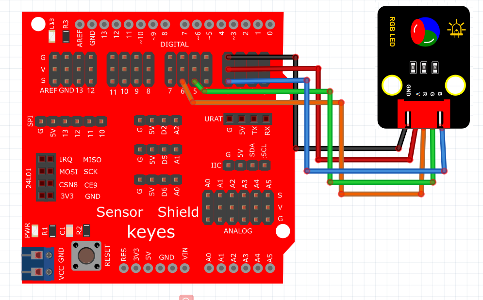
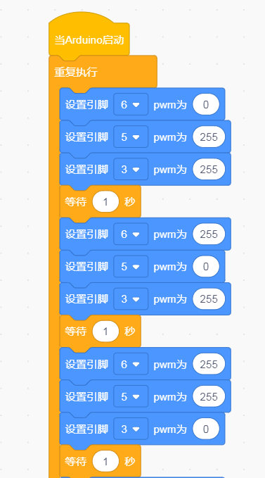
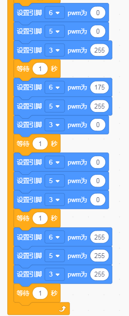

# Kidsblock

### 1. Kidsblock图形化编程软件介绍

**Kidsblock**是一款友好的图形化编程软件，旨在帮助初学者和儿童通过简单的拖放操作学习编程。它提供了一种可视化的编程环境，用户可以通过组合不同的模块来创建程序，从而控制各种硬件设备，例如LED灯、传感器等。Kidsblock特别适合课堂教学和自学，使编程学习充满乐趣和创意。

---

### 2. 连接图

****

### 3. 测试代码

**代码示例：**

### 4. 测试结果

按照上图接好线，烧录好代码，上电后，RGB模块会陆续显示红色1秒，绿色1秒，蓝色1秒，黄色1秒，紫色1秒，白色1秒，停止显示1秒，然后循环交替。

