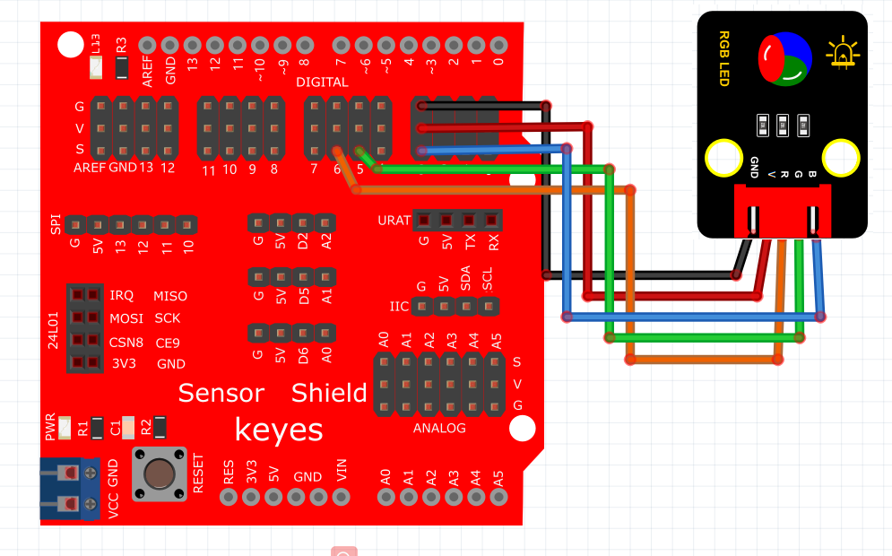

# Mixly

### 1. Mixly图形化编程软件介绍

**Mixly**是一款开源的图形化编程软件，专为初学者和教育工作者设计。它通过简单的拖拽式编程模式，使用户可以快速创建Arduino项目和执行编程任务。Mixly将编程逻辑以可视化形式展示，允许用户通过组合模块来控制硬件，例如LED灯、传感器等。这种可视化的学习方式适合课堂教学和独立学习，使编程变得轻松且富有趣味。

---

### 2. 连接图

****

### 3. 测试代码

**代码示例：**

### 4. 测试结果

按照上图接好线，烧录好代码，上电后，RGB模块会陆续显示红色1秒，绿色1秒，蓝色1秒，黄色1秒，紫色1秒，白色1秒，停止显示1秒，然后循环交替。

