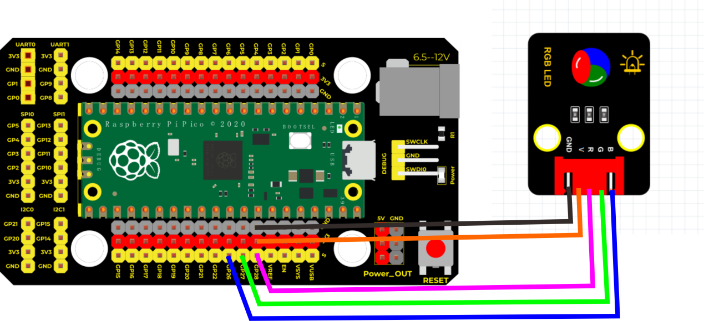

# Python

### 1. MicroPython编程软件介绍

**MicroPython**是一种轻量级的Python实现，专为微控制器编程而设计。它为硬件设备如树莓派Pico等提供了高效且灵活的编程方式。MicroPython简化了与硬件的交互，通过直观的API，使得用户能够快速访问和控制GPIO引脚、PWM输出等各种功能，从而便于实现IoT和嵌入式项目。

---

### 2. 连接图

****

### 3. 测试代码

```python
import utime
from machine import Pin, PWM

PWM_PulseWidth = 0
led_rad = PWM(Pin(28))
led_green = PWM(Pin(27))
led_blue = PWM(Pin(26))

led_rad.freq(500)
led_green.freq(500)
led_blue.freq(500)

while True:
    led_rad.duty_u16(0)
    led_green.duty_u16(65535)
    led_blue.duty_u16(65535)
    utime.sleep(1)

    led_rad.duty_u16(65535)
    led_green.duty_u16(0)
    led_blue.duty_u16(65535)
    utime.sleep(1)

    led_rad.duty_u16(65535)
    led_green.duty_u16(65535)
    led_blue.duty_u16(0)
    utime.sleep(1)

    led_rad.duty_u16(0)
    led_green.duty_u16(0)
    led_blue.duty_u16(65535)
    utime.sleep(1)

    led_rad.duty_u16(30000)
    led_green.duty_u16(65535)
    led_blue.duty_u16(0)
    utime.sleep(1)

    led_rad.duty_u16(0)
    led_green.duty_u16(0)
    led_blue.duty_u16(0)
    utime.sleep(1)

    led_rad.duty_u16(65535)
    led_green.duty_u16(65535)
    led_blue.duty_u16(65535)
    utime.sleep(1)
```

### 4. 代码介绍

- **import machine**  
  机器库包含MicroPython所需的指令，用于与树莓派Pico及其他兼容设备进行通信。

- **import utime**  
  “utime”库处理与时间相关的功能，包括延时，这里的单位为秒。

- **led_rad = PWM(Pin(28))**  
  创建一个PWM对象以控制位于引脚28的LED。

- **led_rad.freq(500)**  
  设置LED的PWM频率为500Hz。

- **led_rad.duty_u16(65535)**  
  将PWM值设置为最大值，以使LED全亮。

- **utime.sleep(1)**  
  暂停程序1秒。

### 5. 测试结果

按照上图接好线，烧录好代码，上电后，RGB模块会陆续显示红色1秒，绿色1秒，蓝色1秒，停止显示1秒，并循环交替。

